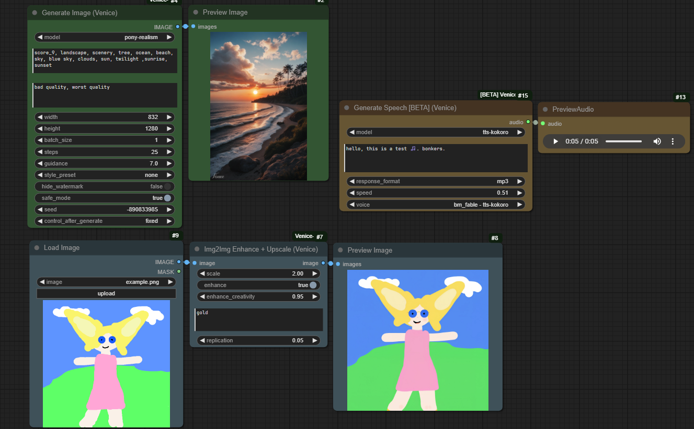
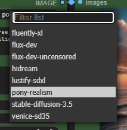
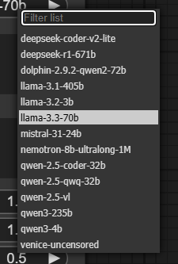

# ComfyUI venice.ai Flux/SDXL/LLM API Nodes

An unofficial custom node implementation for ComfyUI that integrates with venice.ai's Generative AI services such as Image, Text and TTS Generation models (as well as Upscale and Enhance). This project is adapted from [ComfyUI-FLUX-TOGETHER-API](https://github.com/BZcreativ/ComfyUI-FLUX-TOGETHER-API) to work with the venice.ai API.  
**Note**: TTS is in Beta per Venice (as of 15th June 2025). The node for it "Generate Speech (Venice)" is set to BETA/Experimental too. To be able to find it with node search you have to enable "Show experimental nodes in search" setting in ComfyUI.

Disclaimer: I originally made this on a whim because someone wanted something similar to Together.AI custom nodes but have them use venice instead. I'm also not affiliated with Venice.AI. Idk is this good enough for a disclaimer or something

## Nodes: (Text gen node is missing but will be updated soon)

  
Image and Text models (as of 15th June 2025 | for Speech gen only tts-kokoro is available)  
 

~~# todo: inpainting~~  Deprecated by venice, new thing is coming for it at some point

todo: actual log, maybe separate logging file for less clutter from comfyui stuff, maybe, maybe... eeeee

todo: LLM characters list

todo: use variants api (currently in beta) | idk what happened to this

Todo: chat history/memory/context for LLM

todo

- Some Validation on queue for API limits like prompt max length or width/height
  - these are different for different models so this isnt planned to be implemented unless the api exposes those limits somehow
    - i'd have an error thrown before it gets sent to api about some value being too high or too low (though api should send error back for now either way)
    - maybe the api already exposes those limits, the steps limit is afaik at least, need to look into it

### Below ReadMe text is only slightly altered from original Flux Together API readme, it was not really reworked or anything so its likely not correct or up to date

### Features

- Direct integration with venice.ai's Flux and SDXL models
- Support for flux-dev, flux-dev-uncensored, fluently-xl and pony-realism (status: 25th Jan 2025)
- Support for all LLMs venice.ai offers (status: 25th Jan 2025)
- Configurable parameters including steps, guidance scale, and dimensions
  - including fake-ish batch size (just 2 requests after one another returned as 1 output)
- Negative prompt support (ignored when Flux is selected)
- Error handling i guess

### Installation - these instructions are a mess

0. Before proceeding, check if you can find these nodes through ComfyUI-Manager interface rather than following the instructions.

<details><summary>Expand me to see harder instructions</summary>
1. Clone this repository into your ComfyUI custom_nodes directory:

```bash
cd ComfyUI/custom_nodes
git clone https://github.com/DraconicDragon/ComfyUI-Venice-API.git
```

2. Install the required dependencies: (this might be done by comfyui automatically on restart already?)

```bash
pip install -r requirements.txt
```

OR From the Comfyui Folder (this one is usually preferred if you have portable edition)

```bash
 ./python_embeded\python.exe -m pip install -r ComfyUI\custom_nodes\ComfyUI-Venice-API\requirements.txt
```

</details>

### Configuration

1. Get your API key from [venice.ai](https://venice.ai)
2. Add your API key in ComfyUI settings > VeniceAI

### Usage

1. Start ComfyUI
2. Find the "Generate Image (Venice)" in the node browser (double-click empty space in ComfyUI)
    - or the Generate Text (Venice) node
3. Configure the parameters:
    - Prompt: Your image generation prompt
    - Negative Prompt: Elements to avoid in the generation
    - Steps: Generation steps (1-30 or 50)
      - Some models only allow maximum 30 steps while others allow 50. See [venice api docs](https://docs.venice.ai/api-reference/endpoint/image/generate#body-steps). The node and/or API should throw an error if the steps are set too high
    - Width: Image width (0-2048)
    - Height: Image height (0-2048)
      - Venice.AI upper limit is 1280 for width and height but the setting allows higher in   case that limit is changed upwards
    - Seed: Generation seed
    - CFG: Guidance scale (0.0-20.0)

For detailed usage instructions, see [USAGE.md](USAGE.md) (not reworked)

### Parameters for image gen node

| Parameter       | Type    | Range     | Default | Description                             |
|-----------------|---------|-----------|---------|-----------------------------------------|
| prompt          | string  | 1-1500    | "A flying cat made of lettuce"| Main generation prompt |
| negative_prompt | string  | 0-1500    | ""      | Elements to avoid                       |
| width           | integer | 0-1280?   | 1024    | Image width                             |
| height          | integer | 0-1280?   | 1024    | Image height                            |
| batch_size      | integer | 1-4       | 1       | Number of Images to gen in a single run |
| steps           | integer | 1-30 or 50| 20      | Number of generation steps              |
| cfg/guidance    | float   | 0-20.0    | 3.0     | Guidance scale                          |
| style_preset    | string  | N/A       | none    | The Style preset to apply               |
| hide_watermark  | boolean | N/A       | true    | Whether to hide watermark (NSFW = false)|
| safe_mode       | boolean | N/A       | false   | Whether to blur NSFW images             |
| seed            | integer | -999999999 to 999999999 | -1  | Generation seed               |

### License

MIT License - see [LICENSE](LICENSE) file for details.

### Credits

- This project is adapted from [ComfyUI-FLUX-TOGETHER-API](https://github.com/BZcreativ/ComfyUI-FLUX-TOGETHER-API)
- venice.ai for providing the generative AI services and API
- [ComfyUI-FLUX-TOGETHER-API](https://github.com/BZcreativ/ComfyUI-FLUX-TOGETHER-API) for their work
- ComfyUI team for the amazing framework

### Author

Created by [BZcreativ](https://github.com/BZcreativ)

venice.ai rewrite by [DraconicDragon](https://github.com/DraconicDragon)

### Contributing

Contributions are welcome! Feel free to submit a Pull Request.

### Example

todo
